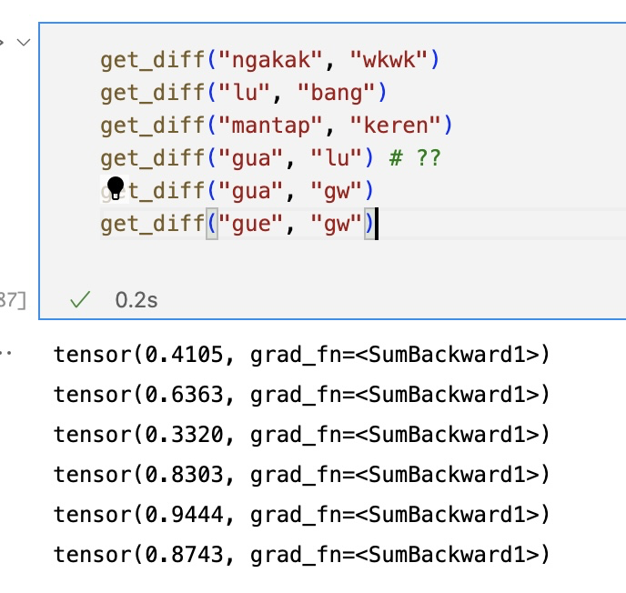

Selamat sore, Pak Alfan.

Maaf mengganggu weekendnya, Pak. Saya sudah memahami skipgram, namun saya mengalami kesulitan mengimplementasi dan memahami CBOW, dan saya punya beberapa pertanyaan:

- Apakah skipgram bisa ditrain terus terusan dan bisakah dia overfit?
  - Jika dia bisa overfit, apakah matriks embeddingnya lama lama dilatih bisa dikatakan overfit juga?
- Apakah di CBOW bila sequence yang kita perhatikan centernya saat ini contextnya di luar sequence masih tetap masuk training data? Misal saat ukuran windows = 1, saat `kamu` pada `kamu makan ayam goreng`, apakah kata `kamu` diinclude sebagai center pada training? ataukah hanya `kamu [makan] ayam` dan `makan [ayam] goreng` saja yang diconsider sebagai training data?
- Model skipgram yang saya latih menganggap kata-kata `lu` dan `gua` cukup similar bentuk embeddingnya (tapi tidak lebih similar dari `lu` dan `lo` serta `gua` dan `gw`) (saya rasa karena setelah kata tersebut seringkali diikuti dengan kata kerja yang sama, apakah ini ada teknik perlakuan khusus untuk menanganinya, Pak?)
- Pada model CBOW, Apakah perlu memperlakukan secara khusus occurence kata di contextnya yang lebih dari satu, misal pada sequence `kemarin aku rasa aku lapar`, bila centernya `rasa`, apakah `aku` tetap diproses seperti one hot satu?
  - Bila dari slide, saya rasa sequence di atas karena urutan contextnya tidak diperhatikan, berarti `aku aku rasa lapar kemarin`, dianggap "sequence yang sama", kah Pak?

Berikut saya juga sampaikan pemahaman vec2word model saya untuk kedua skipgram dan cbow saya, Pak. Saya takut salah paham dan kodingannya salah. :pray:

---

### Pemahaman Skipgram Saya

Saya sudah mengerti implementasi skipgram, yakni misal kita punya sentences:

```
saya cinta ayam goreng
saya goreng ayam
```

dengan vocabulary

```
{
	saya: 0,
	cinta: 1,
	ayam: 2,
	goreng: 3
}
```

Misal kita punya training data yang sudah direduksi (kita berikan center, mencari konteks di sekelilingnya, misal ukuran windows = 1, alias bigram)

Kita tuliskan multiset training data $T$ berukuran $8$ sebagai berikut:

```
(masukan, keluaran):
0: saya cinta
1: cinta saya
2: cinta ayam
3: ayam cinta
4: ayam goreng
5: saya goreng
6: goreng saya
7: goreng ayam
```

- Misalkan ukuran embedding saya buat jadi $E = 3$.

- Berarti kita akan mempunyai matriks embedding $C$ berukuran $|V| \times E = 4 \times 3$ dan matriks konteks $W$ ukurannya $E \times |V| = 3 \times 4$.

- Karena kita punya $|T|$ = 8 training data (anggap tidak saya batch lebih kecil, jadi satu epoch saya train langsung dengan 8 data tersebut,)

- Saya mula-mula akan membentuk sebuah matriks masukan $X$ berukuran $|T| \times |V|$ dengan setiap barisnya merupakan one hot encoding `masukan`  dari pasangan berurut $|T| = 8$ buah training data `(masukan, keluaran)`.

- Kemudian saya susun matriks keluaran $Y$ berukuran $|T| \times |V|$ juga dengan setiap barisnya merupakan one hot encoding dari `keluaran` dari pasangan berurut `(masukan, keluaran)`.

- Saat training, saya akan menghitung $\hat{Y} = \text{Softmax}(X \times C\times W)$, kemudian saya hitung loss functionnya terhadap matriks $Y$, lalu saya backward propagation, itu satu epoch. Dalam praktisnya, hitung softmax bisa menggunakan Hierarchical softmax.

### Pemahaman CBOW saya

yang saya tahu, pada CBOW kita akan berikan dia context dan kita akan menebak centernya, misal saya set windowsnya masih sama dengan 1.

```
saya cinta ayam goreng
saya goreng ayam
```

Vocab:

```
{
	saya: 0,
	cinta: 1,
	ayam: 2,
	goreng: 3
}
```

Kita tuliskan multiset training data $T$ berukuran $3$ (saya tidak yakin apakah hanya 3 saja yang bisa diinfer) sebagai berikut:

```
(masukan, keluaran):
0: ([saya, ayam], cinta)
1: ([cinta, goreng], ayam)
2: ([saya, ayam], goreng)
```

- Misal saya pilih ukuran window $R = 1$
- Misalkan ukuran embedding saya buat masih tetap $E = 3$. **(masih sama dengan Skipgram)**

- Berarti kita akan mempunyai matriks embedding $C$ berukuran $|V| \times E = 4 \times 3$ dan matriks konteks $W$ ukurannya $E \times |V| = 3 \times 4$. **(masih sama dengan skipgram)**

Sampai disini saya ragu, dan saya menemukan dua ide:

### Ide Pertama

- Karena kita punya $|T|$ = 3 training data, maka satu epoch masing masing akan melalui satu training data

- Saya mula-mula akan membentuk sebuah matriks masukan $X$ berukuran $2R \times |V|$ dengan setiap barisnya merupakan one hot encoding dari entri `masukan`  pada pasangan berurut `(masukan, keluaran)`.

- Kemudian saya susun matriks keluaran $Y$ berukuran $1 \times |V|$ yang mewakili one hot encoding dari `keluaran` dari pasangan berurut `(masukan, keluaran)`

  - Misal pada epoch pertama, $X$ nya setiap barisnya bakal mewakili entri `[saya, ayam]`, dan $Y$ nya mewakili `cinta`

  - Sehingga $X$ nya jadi:

    - $$
      \begin{bmatrix}1 & 0 & 0 & 0\\0 & 0 & 1 & 0\end{bmatrix}
      $$

  - dan $Y$ nya jadi:

    - $$
      \begin{bmatrix}0 & 1 & 0 & 0\end{bmatrix}
      $$

- Perhitungannya bakal jadi matriks $H = X \times C$, matriks $H$ berukuran $2R \times E$, lalu itu kita average setiap entri barisnya, katakan menjadi $A$, kemudian hitung $\hat{Y} = \text{Softmax}(A \times W)$. Dengan kata lain:
  - $\hat{Y} = \text{Softmax}(\text{Average}(X \times C) \times W)$

### Ide Kedua

- Karena kita punya $|T|$ = 3 training data, sebenarnya kita satu epoch tetap bisa batch semua training datanya

- Saya mula-mula akan membentuk sebuah matriks masukan $X$ berukuran $|T| \times |V|$ dengan setiap barisnya merupakan **mean atau rataan** dari one hot encoding dari entri `masukan`  pada pasangan berurut `(masukan, keluaran)`.

- Kemudian saya susun matriks keluaran $Y$ berukuran $|T| \times |V|$ yang mewakili one hot encoding dari `keluaran` dari pasangan berurut `(masukan, keluaran)`

  - Misal pada epoch pertama, $X$ nya setiap barisnya bakal mewakili entri satu training data, yaitu `([saya, ayam], [cinta, goreng], [saya, ayam])`  , dan $Y$ nya mewakili `(cinta, goreng, ayam)`

  - Sehingga $X$ nya jadi:

    - $$
      \begin{bmatrix}0.5 & 0 & 0.5 & 0\\0 & 0.5 & 0 & 0.5\\0.5 & 0 & 0.5 &0\end{bmatrix}
      $$

  - dan $Y$ nya jadi:

    - $$
      \begin{bmatrix}0 & 1 & 0 & 0 \\0 & 0 & 0 & 1\\0 & 0 & 1 & 0\end{bmatrix}
      $$

- Perhitungannya bakal langsung aja, $\hat{Y} = \text{Softmax}(X \times C\times W)$, 

Saya merasa ide kedua sama saja dengan ide pertama, dan harusnya lebih cepat, karena pada dasarnya fungsi transformasi $\text{Average}(M)$ pada matriks $M$ berukuran $m \times n$ bisa dinyatakan sebagai perkalian matriks $A \times M$ dengan $A = [\frac{}{}]$ 